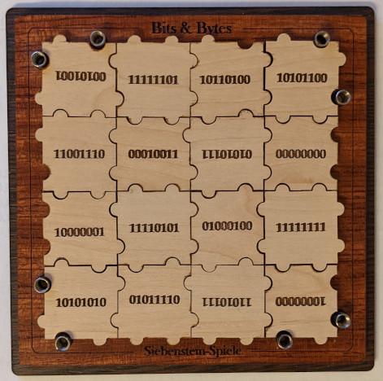

Bits & Bytes
============

Bits & Bytes is a 2D puzzle made by Siebenstein-Spiele. In the following
picture you can see one possible solution:

Algorithm X / DLX
-----------------
This project is a solver using an exact cover approach.

It is a java implementation of Donald Knuth's algorithm x using "dancing
links", also called DLX. Look into the
[original paper](https://arxiv.org/abs/cs/0011047) for further information.

There are different kinds of constraints:

1. one constraint for every position a nose can be on (80 constraints)
2. one constraint for every position on the board, each is satisfied when a
   piece is placed on it (16 constraints)
3. one constraint for each piece that can be placed on the board
   (16 constraints)
4. one constraint for the "border sticks"

Every piece gets rotated and placed on every position on the board. This
leads to many choices. Each of them fulfills up to eight constraints of the
first type, exactly one of the second and exactly one of the third type.

In addition to these choices there are some special choices, that
fulfill only one constraint of the first type. For each outer nose position
one of these choices gets generated to make these nose positions optional.

Solutions
---------
The puzzle has 12,496 solutions. As each piece gets rotated by 90, 180 and
270 degree, each solution has three equivalent ones leading to 3,124
distinct solutions.

When playing around with the way the choices get generated, one can see
that there is no solution without any piece rotated. But there are two
solutions with only a few pieces rotated by 180 degree, which looks a bit
like no piece being rotated. One of these solutions is shown above.

Optimization
------------
In the branch named "optimized" there is a variation of the puzzle with
different pieces. The pieces are modified only slightly. The rotated pieces
get a different (equivalent but rotated) label and one piece is varied in a
way that the total summed number of noses and notches are equal.

In addition, the branch contains commented out code that can be used to
find solutions with "holes" in the middle of the board.